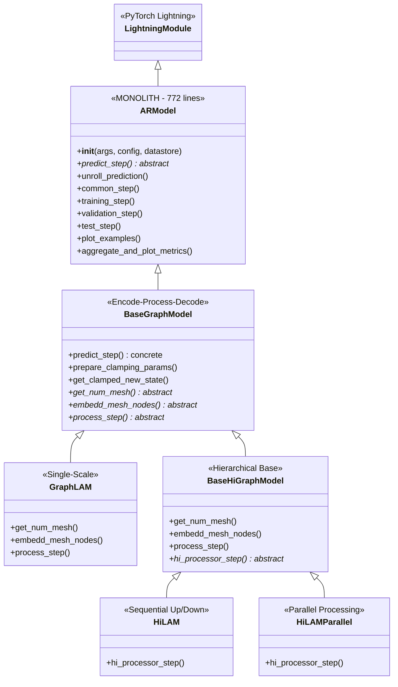

# Neural-LAM Codebase Deep-Dive & Classification Document

> **Author:** Aswani Sahoo  
> **Date:** March 1, 2026  
> **Context:** GSoC 2026 — Refactoring `ar_model.py` (Issue #49)

---

## Table of Contents

1. [Architecture Overview](#1-architecture-overview)
2. [File-by-File Analysis](#2-file-by-file-analysis)
   - [File 1: `ar_model.py`](#file-1-ar_modelpy--the-monolith)
   - [File 2: `base_graph_model.py`](#file-2-base_graph_modelpy)
   - [File 3: `base_hi_graph_model.py`](#file-3-base_hi_graph_modelpy)
   - [File 4: `graph_lam.py`](#file-4-graph_lampy)
   - [File 5: `hi_lam.py`](#file-5-hi_lampy)
   - [File 5b: `hi_lam_parallel.py`](#file-5b-hi_lam_parallelpy)
   - [File 6: `interaction_net.py`](#file-6-interaction_netpy)
   - [File 7: `metrics.py`](#file-7-metricspy)
   - [File 8: `vis.py`](#file-8-vispy)
3. [ar_model.py Method-Level Classification](#3-ar_modelpy-method-level-classification)
4. [Inheritance Hierarchy](#4-inheritance-hierarchy)
5. [Key Observations for Refactoring](#5-key-observations-for-refactoring)

---

## 1. Architecture Overview

Neural-LAM follows an **encode-process-decode** paradigm for graph-based weather forecasting. The central design uses PyTorch Lightning for training orchestration and PyTorch Geometric for GNN message passing.

```
Inheritance Hierarchy:
                pl.LightningModule
                        │
                    ARModel            ← THE MONOLITH (772 lines)
                        │
                  BaseGraphModel       ← Encode-Process-Decode + predict_step
                   ╱          ╲
             GraphLAM    BaseHiGraphModel  ← Hierarchical base
                           ╱          ╲
                       HiLAM     HiLAMParallel
```

The **core GNN layer** is `InteractionNet` (extends `pyg.nn.MessagePassing`), used everywhere as building blocks in encoder/processor/decoder.

---

## 2. File-by-File Analysis

---

### File 1: `ar_model.py` — THE MONOLITH

| Property | Value |
|---|---|
| **Path** | `neural_lam/models/ar_model.py` |
| **Lines** | 772 (Lines 24–772 are the `ARModel` class) |
| **Class** | `ARModel(pl.LightningModule)` |
| **Joel #49 Category** | **Mixed** — contains ForecasterModule + AR_Forecaster + Loss + Metrics |
| **Purpose** | Generic auto-regressive weather model. Abstract base class extended by all concrete models. |

**What it contains (summary):**

- **Lightning lifecycle**: `__init__`, `configure_optimizers`, `on_load_checkpoint`, logging, device handling
- **AR rollout**: `unroll_prediction` (autoregressive loop with boundary masking)
- **Abstract interface**: `predict_step` (raises `NotImplementedError`)
- **Loss computation**: Inside `training_step`, `validation_step`, `test_step`
- **Metric aggregation**: `create_metric_log_dict`, `aggregate_and_plot_metrics`
- **Plotting**: `plot_examples`, spatial loss map plotting in `on_test_epoch_end`
- **Data helpers**: `_create_dataarray_from_tensor`, `expand_to_batch`

> ⚠️ **This is the file that gets refactored.** Full method classification in [Section 3](#3-ar_modelpy-method-level-classification).

---

### File 2: `base_graph_model.py`

| Property | Value |
|---|---|
| **Path** | `neural_lam/models/base_graph_model.py` |
| **Lines** | 366 |
| **Class** | `BaseGraphModel(ARModel)` |
| **Joel #49 Category** | **StepPredictor** |
| **Purpose** | Implements the encode-process-decode `predict_step`. Defines graph loading, embedding layers, encoder/decoder GNNs, output mapping, and output clamping. |

**Classes/Methods:**

| Method | Lines | Purpose |
|---|---|---|
| `__init__` | 18-83 | Loads graph, creates embedders (grid, g2m, m2g), encoder GNN (`g2m_gnn`), decoder GNN (`m2g_gnn`), output MLP. Calls `prepare_clamping_params`. |
| `prepare_clamping_params` | 85-218 | Sets up sigmoid/softplus clamping functions to enforce valid output ranges per variable. |
| `get_clamped_new_state` | 220-266 | Applies clamping to predicted state delta + prior state. |
| `get_num_mesh` | 268-273 | **Abstract** — returns mesh node count. |
| `embedd_mesh_nodes` | 275-280 | **Abstract** — embed static mesh features. |
| `process_step` | 282-290 | **Abstract** — mesh processing step. |
| `predict_step` | 292-365 | **Concrete implementation** of the full encode-process-decode pipeline: concatenates features → embeds → g2m GNN → process → m2g GNN → output map → rescale delta → clamp. Returns `(new_state, pred_std)`. |

**Key observation:** This is where the actual single-step prediction logic lives. It overrides `ARModel.predict_step` and provides the encode-process-decode framework while keeping `process_step` abstract for subclasses.

---

### File 3: `base_hi_graph_model.py`

| Property | Value |
|---|---|
| **Path** | `neural_lam/models/base_hi_graph_model.py` |
| **Lines** | 238 |
| **Class** | `BaseHiGraphModel(BaseGraphModel)` |
| **Joel #49 Category** | **StepPredictor** (hierarchical specialization) |
| **Purpose** | Base class for hierarchical graph models. Handles multi-level mesh embedding, mesh initialization (bottom-up), mesh read-out (top-down), and delegates processor step to subclasses. |

**Classes/Methods:**

| Method | Lines | Purpose |
|---|---|---|
| `__init__` | 17-102 | Creates per-level mesh/edge embedders. Builds `mesh_init_gnns` (up edges) and `mesh_read_gnns` (down edges). |
| `get_num_mesh` | 104-115 | Returns total mesh nodes across all levels and nodes to ignore in encoding. |
| `embedd_mesh_nodes` | 117-124 | Embeds only bottom level mesh; rest done in `process_step`. |
| `process_step` | 126-219 | Full hierarchical processing: embed remaining levels → embed edges → mesh init (bottom-up) → `hi_processor_step` → mesh read-out (top-down) → return bottom level. |
| `hi_processor_step` | 221-237 | **Abstract** — the internal processor between init and read-out. |

---

### File 4: `graph_lam.py`

| Property | Value |
|---|---|
| **Path** | `neural_lam/models/graph_lam.py` |
| **Lines** | 92 |
| **Class** | `GraphLAM(BaseGraphModel)` |
| **Joel #49 Category** | **StepPredictor** (concrete single-scale) |
| **Purpose** | Full graph-based LAM model for non-hierarchical graphs. Based on GraphCast / Keisler (2022). Used for GC-LAM and L1-LAM in Oskarsson et al. (2023). |

**Classes/Methods:**

| Method | Lines | Purpose |
|---|---|---|
| `__init__` | 20-57 | Asserts non-hierarchical graph. Creates mesh embedder, m2m embedder, and a sequential processor (stacked `InteractionNet` layers). |
| `get_num_mesh` | 59-64 | Returns `(mesh_nodes, 0)` — no nodes to ignore. |
| `embedd_mesh_nodes` | 66-71 | Embeds mesh static features via `mesh_embedder`. |
| `process_step` | 73-91 | Embeds m2m edges, runs the sequential processor GNN. |

---

### File 5: `hi_lam.py`

| Property | Value |
|---|---|
| **Path** | `neural_lam/models/hi_lam.py` |
| **Lines** | 208 |
| **Class** | `HiLAM(BaseHiGraphModel)` |
| **Joel #49 Category** | **StepPredictor** (concrete hierarchical) |
| **Purpose** | Hierarchical graph model with sequential down-then-up message passing during processing. The Hi-LAM model from Oskarsson et al. (2023). |

**Classes/Methods:**

| Method | Lines | Purpose |
|---|---|---|
| `__init__` | 18-35 | Creates down GNNs, down-same GNNs, up GNNs, and up-same GNNs for each processor layer. |
| `make_same_gnns` | 37-50 | Factory for intra-level GNNs. |
| `make_up_gnns` | 52-65 | Factory for up-hierarchy GNNs. |
| `make_down_gnns` | 67-80 | Factory for down-hierarchy GNNs. |
| `mesh_down_step` | 82-124 | Runs down-part: alternates between down edges and same-level edges, level L → level 0. |
| `mesh_up_step` | 126-163 | Runs up-part: alternates between up edges and same-level edges, level 0 → level L. |
| `hi_processor_step` | 165-207 | Implements the abstract method: iterates processor layers, each doing down → up. |

---

### File 5b: `hi_lam_parallel.py`

| Property | Value |
|---|---|
| **Path** | `neural_lam/models/hi_lam_parallel.py` |
| **Lines** | 100 |
| **Class** | `HiLAMParallel(BaseHiGraphModel)` |
| **Joel #49 Category** | **StepPredictor** (concrete hierarchical — parallel variant) |
| **Purpose** | Version of HiLAM where all message passing in the hierarchical mesh (up, down, inter-level) is ran in parallel. A simpler alternative to the sequential down-then-up message passing of HiLAM. |

**Classes/Methods:**

| Method | Lines | Purpose |
|---|---|---|
| `__init__` | 21-53 | Combines all edge indices (m2m + up + down) into a single `total_edge_index`. Creates a single stacked `InteractionNet` processor that uses `edge_chunk_sizes` and `aggr_chunk_sizes` per level via `SplitMLPs`. |
| `hi_processor_step` | 55-99 | Implements the abstract method: concatenates all mesh level representations and edge representations into single tensors, runs the unified processor, then splits results back into per-level lists. |

**Key observation:** Unlike `HiLAM` which processes down→up sequentially per level, `HiLAMParallel` concatenates everything and processes all levels in one shot using chunked MLPs (`SplitMLPs`). This is simpler but loses the sequential information flow between levels.

---

### File 6: `interaction_net.py`

| Property | Value |
|---|---|
| **Path** | `neural_lam/interaction_net.py` |
| **Lines** | 164 |
| **Classes** | `InteractionNet(pyg.nn.MessagePassing)`, `SplitMLPs(nn.Module)` |
| **Joel #49 Category** | **StepPredictor** (core building block) |
| **Purpose** | Generic Interaction Network (Battaglia et al. 2016) — the foundational GNN layer used in all graph models. |

**`InteractionNet` Methods:**

| Method | Lines | Purpose |
|---|---|---|
| `__init__` | 19-84 | Sets up edge_index, edge_mlp (`[3*input_dim] + [hidden_dim]*(hidden_layers+1)`), aggr_mlp (`[2*input_dim] + [hidden_dim]*(hidden_layers+1)`). `hidden_dim` defaults to `input_dim` if not set. Supports chunked MLPs via `SplitMLPs`. |
| `forward` | 86-115 | Concatenates `[rec, send]`, propagates messages, applies aggr_mlp with residual, optionally returns updated edges. |
| `message` | 117-121 | Edge MLP applied to `[edge_attr, x_j, x_i]`. |
| `aggregate` | 124-131 | Overridden to return both aggregated and original messages, only aggregating to receiver nodes. |

**`SplitMLPs` Methods:**

| Method | Lines | Purpose |
|---|---|---|
| `__init__` | 141-148 | Stores list of MLPs and chunk sizes. |
| `forward` | 150-163 | Splits input along dim -2, feeds each chunk through its MLP, concatenates. |

---

### File 7: `metrics.py`

| Property | Value |
|---|---|
| **Path** | `neural_lam/metrics.py` |
| **Lines** | 238 |
| **Classes** | None (module-level functions) |
| **Joel #49 Category** | **Metrics** (standalone utility) |
| **Purpose** | Defines deterministic loss/metric functions for training and evaluation. |

**Functions:**

| Function | Lines | Purpose |
|---|---|---|
| `get_metric` | 5-18 | Metric registry lookup by name string. |
| `mask_and_reduce_metric` | 21-53 | Helper: applies grid mask, optionally reduces over grid (mean) and vars (sum). |
| `wmse` | 56-84 | Weighted MSE: `MSE / σ²`. |
| `mse` | 87-108 | Unweighted MSE (calls `wmse` with `std=1`). |
| `wmae` | 111-139 | Weighted MAE: `MAE / σ`. |
| `mae` | 142-163 | Unweighted MAE (calls `wmae` with `std=1`). |
| `nll` | 166-190 | Negative log-likelihood for isotropic Gaussian. |
| `crps_gauss` | 193-227 | Continuous Ranked Probability Score (closed-form Gaussian). |
| `DEFINED_METRICS` | 229-238 | Registry dict mapping metric name strings to functions. |

**Key observation:** All metrics follow the signature `(pred, target, pred_std, mask, average_grid, sum_vars)`. Currently only deterministic metrics — probabilistic metrics (`nll`, `crps_gauss`) exist but are not ensemble-based.

---

### File 8: `vis.py`

| Property | Value |
|---|---|
| **Path** | `neural_lam/vis.py` |
| **Lines** | 185 |
| **Classes** | None (module-level functions) |
| **Joel #49 Category** | **ForecasterModule** (visualization utility) |
| **Purpose** | Plotting utilities for error maps, predictions, and spatial errors. |

**Functions:**

| Function | Lines | Purpose |
|---|---|---|
| `plot_error_map` | 12-66 | Heatmap of `(pred_steps × d_f)` errors. Normalizes per variable, uses `OrRd` colormap. (Line 12 = `@rc_context` decorator) |
| `plot_prediction` | 69-126 | Side-by-side plot of ground truth vs. prediction on a spatial map with coastlines. (Line 69 = decorator) |
| `plot_spatial_error` | 129-184 | Spatial error map on the grid with coastlines and colorbar. (Line 129 = decorator; line 185 is empty) |

**Key observation:** All plotting functions require a `BaseRegularGridDatastore` — tightly coupled to the datastore interface. Uses matplotlib with `rc_context` for consistent styling.

---

## 3. ar_model.py Method-Level Classification

This is the **key exercise** — every method in `ARModel` classified by Joel's #49 categories:

| # | Method | Lines | Category | Rationale |
|---|---|---|---|---|
| 1 | `__init__` | 33-161 | **[FORECASTER_MODULE]** | Lightning module setup: `save_hyperparameters`, registers buffers (static features, state stats, masks), sets up loss function, initializes metric containers, configures plotting counters. Also touches `[LOSS]` (instantiates loss) and `[METRICS]` (initializes metric dicts). |
| 2 | `_create_dataarray_from_tensor` | 163-199 | **[FORECASTER_MODULE]** | Data conversion utility for plotting — converts tensor back to `xr.DataArray` using `WeatherDataset`. Part of the Lightning module's data handling, not core forecasting logic. |
| 3 | `configure_optimizers` | 201-205 | **[FORECASTER_MODULE]** | Pure Lightning lifecycle: configures AdamW optimizer with `lr` and `betas=(0.9, 0.95)`. |
| 4 | `interior_mask_bool` (property) | 207-212 | **[AR_FORECASTER]** | Utility property used in loss computation and metric calculation — provides boolean interior mask. Bridges `[FORECASTER_MODULE]` buffers with `[LOSS]`/`[METRICS]`. |
| 5 | `expand_to_batch` (static) | 214-219 | **[STEP_PREDICTOR]** | Utility to expand non-batched tensors with batch dimension. Used in `predict_step` implementations (in `BaseGraphModel`). |
| 6 | `predict_step` | 221-228 | **[STEP_PREDICTOR]** | **Abstract method** — single-step prediction interface `(X_{t-1}, X_t) → X_{t+1}`. Overridden in `BaseGraphModel`. |
| 7 | `unroll_prediction` | 230-277 | **[AR_FORECASTER]** | Core AR rollout loop: iterates over `pred_steps`, calls `predict_step`, applies boundary masking (`boundary_mask * border_state + interior_mask * pred_state`), collects predictions. This is the heart of autoregressive forecasting. |
| 8 | `common_step` | 279-295 | **[AR_FORECASTER]** | Unpacks batch and calls `unroll_prediction`. Shared by `training_step`, `validation_step`, `test_step`. Bridges data loading with AR rollout. |
| 9 | `training_step` | 297-319 | **[LOSS]** + **[FORECASTER_MODULE]** | Calls `common_step` → computes weighted loss over interior mask → logs `train_loss` via Lightning's `self.log_dict`. Loss computation is `[LOSS]`, logging is `[FORECASTER_MODULE]`. |
| 10 | `all_gather_cat` | 321-330 | **[FORECASTER_MODULE]** | Distributed training utility: gathers tensors across ranks and flattens. Used for metric aggregation in multi-GPU. |
| 11 | `validation_step` | 334-371 | **[LOSS]** + **[METRICS]** + **[FORECASTER_MODULE]** | Computes per-step loss, logs val metrics, stores per-entry MSEs in `val_metrics` for epoch-end aggregation. |
| 12 | `on_validation_epoch_end` | 373-382 | **[METRICS]** | Calls `aggregate_and_plot_metrics` for validation, clears metric lists. |
| 13 | `test_step` | 385-464 | **[LOSS]** + **[METRICS]** + **[FORECASTER_MODULE]** | Full test evaluation: computes loss, stores MSE/MAE per variable, computes spatial loss maps, triggers example plotting. The most interleaved method — touches all categories. |
| 14 | `plot_examples` | 466-591 | **[FORECASTER_MODULE]** | Generates prediction vs. ground truth plots for `n_examples`. Rescales predictions, creates per-variable per-timestep figures using `vis.plot_prediction`, logs images to logger (Wandb/MLFlow), saves `.pt` files. |
| 15 | `create_metric_log_dict` | 593-633 | **[METRICS]** | Builds a dict of items to log for one metric: creates error map figure via `vis.plot_error_map`, saves PDF/CSV for test prefix, handles watched metrics. |
| 16 | `aggregate_and_plot_metrics` | 635-688 | **[METRICS]** + **[FORECASTER_MODULE]** | Gathers metrics across ranks, averages, converts MSE→RMSE, rescales by `state_std`, creates log dicts, logs figures to logger. |
| 17 | `on_test_epoch_end` | 690-746 | **[METRICS]** + **[FORECASTER_MODULE]** | Aggregates test metrics, creates spatial loss map figures, logs and saves PDFs, saves `mean_spatial_loss.pt`. The most visualization-heavy epoch-end hook. |
| 18 | `on_load_checkpoint` | 748-772 | **[FORECASTER_MODULE]** | Handles checkpoint loading: fixes old InteractionNet keys, optionally resets optimizer state. |

### Classification Summary for ar_model.py

```
┌──────────────────────────┬───────────────────────────────────────────────────┐
│ Category                 │ Methods                                           │
├──────────────────────────┼───────────────────────────────────────────────────┤
│ [FORECASTER_MODULE]      │ __init__ (partial), _create_dataarray_from_tensor,│
│ Lightning lifecycle,     │ configure_optimizers, all_gather_cat,             │
│ logging, plotting,       │ plot_examples, on_load_checkpoint                 │
│ device handling          │                                                   │
├──────────────────────────┼───────────────────────────────────────────────────┤
│ [AR_FORECASTER]          │ interior_mask_bool, unroll_prediction,            │
│ AR rollout logic,        │ common_step                                       │
│ boundary masking,        │                                                   │
│ state updates            │                                                   │
├──────────────────────────┼───────────────────────────────────────────────────┤
│ [STEP_PREDICTOR]         │ expand_to_batch, predict_step (abstract)          │
│ Single-step prediction   │                                                   │
├──────────────────────────┼───────────────────────────────────────────────────┤
│ [LOSS]                   │ training_step (partial), validation_step          │
│ Loss computation inside  │ (partial), test_step (partial)                    │
│ train/val/test steps     │                                                   │
├──────────────────────────┼───────────────────────────────────────────────────┤
│ [METRICS]                │ on_validation_epoch_end, create_metric_log_dict,  │
│ Metric aggregation,      │ aggregate_and_plot_metrics, on_test_epoch_end,    │
│ error maps, logging      │ validation_step (partial), test_step (partial)    │
└──────────────────────────┴───────────────────────────────────────────────────┘
```

### Visual: Method → Category Mapping

```
ar_model.py
│
├── __init__                        → [FORECASTER_MODULE] (+ [LOSS] init)
├── _create_dataarray_from_tensor   → [FORECASTER_MODULE]
├── configure_optimizers            → [FORECASTER_MODULE]
├── interior_mask_bool              → [AR_FORECASTER]
├── expand_to_batch                 → [STEP_PREDICTOR]
├── predict_step                    → [STEP_PREDICTOR] (abstract)
├── unroll_prediction               → [AR_FORECASTER]  ←核心 AR loop
├── common_step                     → [AR_FORECASTER]
├── training_step                   → [LOSS] + [FORECASTER_MODULE]
├── all_gather_cat                  → [FORECASTER_MODULE]
├── validation_step                 → [LOSS] + [METRICS] + [FORECASTER_MODULE]
├── on_validation_epoch_end         → [METRICS]
├── test_step                       → [LOSS] + [METRICS] + [FORECASTER_MODULE]
├── plot_examples                   → [FORECASTER_MODULE]
├── create_metric_log_dict          → [METRICS]
├── aggregate_and_plot_metrics      → [METRICS] + [FORECASTER_MODULE]
├── on_test_epoch_end               → [METRICS] + [FORECASTER_MODULE]
└── on_load_checkpoint              → [FORECASTER_MODULE]
```

---

## 4. Inheritance Hierarchy



---

## 5. Key Observations for Refactoring

### 5.1. Why ar_model.py is the Monolith

The fundamental problem is that `ARModel` mixes **five different responsibilities** into one class:

1. **Lightning lifecycle management** (optimizer, checkpointing, distributed ops)
2. **AR rollout logic** (the loop that calls `predict_step` repeatedly)
3. **The `predict_step` interface** (abstract single-step prediction)
4. **Loss computation** (inside `training_step`/`validation_step`/`test_step`)
5. **Metric aggregation & plotting** (error maps, spatial losses, example predictions)

### 5.2. The Most Tangled Methods

- **`training_step`** (L297-319): Interleaves AR rollout (`common_step`), loss computation, and logging.
- **`test_step`** (L385-464): The worst offender — touches loss, metrics, spatial maps, AND example plotting.
- **`__init__`** (L33-161): Sets up everything from data loading to loss function to metric containers to plotting counters.

### 5.3. Clean Separation Points

| From ARModel | Extract To | What Moves |
|---|---|---|
| `unroll_prediction`, `common_step`, boundary masking | **AR_Forecaster** class | The autoregressive loop |
| `training_step` loss + `validation_step` loss | **Loss module** | Loss computation |
| `create_metric_log_dict`, `aggregate_and_plot_metrics`, metric storage | **Metrics module** | All metric aggregation |
| `plot_examples`, `_create_dataarray_from_tensor` | **Visualization callbacks** | Plotting logic |
| `predict_step` (abstract) | **StepPredictor** interface | Single-step prediction interface |
| `configure_optimizers`, `on_load_checkpoint`, `all_gather_cat` | **ForecasterModule** (thin Lightning wrapper) | What remains |

### 5.4. Dependencies Between Files

```
metrics.py  ←  ar_model.py  →  vis.py
                    ↑
             base_graph_model.py  →  interaction_net.py
                    ↑
           ┌────────┤
     graph_lam.py   base_hi_graph_model.py
                          ↑
                     hi_lam.py
```

`interaction_net.py` and `metrics.py` are **leaf modules** with no internal dependencies — clean and independent. `vis.py` depends only on `BaseRegularGridDatastore`.

---
